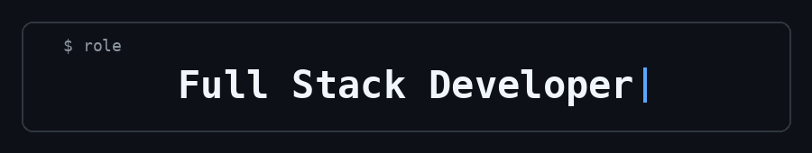

# 👋 Hi there, I'm Edward Geraldo Kristian

### I build apps, websites, and AI-powered solutions.

---

## 👨🏻‍💻 About Me

I'm an **Information Systems for Business** student at **Ciputra University**.

I build across **iOS apps, web applications, and AI-powered solutions**, with an interest in data analysis and machine learning. I like understanding how things work instead of just making them work.

---

## 🛠️ Tech Stack

### Languages

### Frameworks

### Tools & Technologies

---

### 💭

**Building, Learning and eager to learn how things work.**

---

## 📌 Featured Projects

Check out my **pinned repositories** below to see what I've been building.

